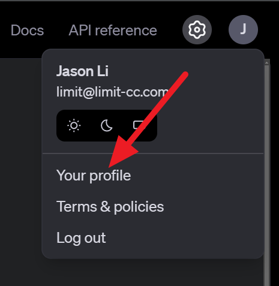

# OpenAI API TTS Gen Component by LCC

## What is this for?
Uses [OpenAI's Python SDK](https://github.com/openai/openai-python) to convert text to speech given your configured model. For information on their speech generation API, visit [their docs](https://platform.openai.com/docs/guides/text-generation). Code for speech streaming was taken from their [example](https://github.com/openai/openai-python/blob/main/examples/audio.py).

## Setup

Windows
```
conda create -n jaison-comp-ttsg-openai-api python=3.12 ffmpeg
conda activate jaison-comp-ttsg-openai-api
pip install -r requirements.txt
```

Unix
```
python -m venv venv
source venv/bin/activate
pip install -r requirements.txt
```

Furthermore, create a `.env` file in the root of this project with the following:
```
OPENAI_API_KEY=<openai api key like sk-...>
```
You can find you OpenAI API token [here](https://platform.openai.com/api-keys) as shown below:




## Testing
Assuming you are in the right virtual environment and are in the root directory:
```
python ./src/main.py --port=5000
```
If it runs, it should be fine.

## Configuration
In `config.json`, you can set your desired voice model and voice as listed [by OpenAI](https://platform.openai.com/docs/guides/text-to-speech).

## Related stuff
Project J.A.I.son: https://github.com/limitcantcode/jaison-core

Join the community Discord: https://discord.gg/Z8yyEzHsYM
